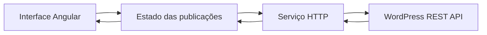
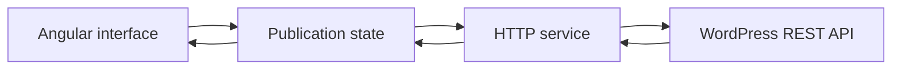

<div align="center">
  

  # Sanaka

  **Um santuário digital para textos, estudos, histórias e conversas.**  
  **A digital sanctuary for writings, studies, stories, and conversations.**

  
  
  
  
  

  [Português](#português) · [English](#english)
</div>

---

<a id="português"></a>

## Português

### Sobre o projeto

Sanaka nasceu como uma reconstrução técnica e editorial de um acervo mantido no WordPress. O WordPress permanece como sistema de gerenciamento de conteúdo, enquanto o Angular assume a experiência apresentada à pessoa leitora.

Essa separação permite evoluir a interface sem perder o histórico já publicado e cria uma base para dois contextos relacionados:

- **Sanaka:** pensamentos, estudos e conteúdos ligados ao santuário;
- **WoD:** contos, romances e personagens do antigo Mundo das Trevas;
- **conteúdo compartilhado:** publicações que pertencem aos dois universos sem serem duplicadas no WordPress.

### O que já está implementado

- página inicial responsiva com identidade visual própria;
- interface disponível em português e inglês;
- arquivo de publicações consumido pela WordPress REST API;
- busca com espera de 300 ms entre a digitação e a requisição;
- leitura contínua com carregamento incremental;
- leitura paginada com URLs navegáveis;
- capas, categorias, títulos, resumos e datas vindos do WordPress;
- estados visuais de carregamento, erro, nova tentativa e ausência de resultados;
- carregamento tardio das rotas de publicações e de Māyā;
- renderização híbrida, combinando prerenderização e execução no navegador;
- testes unitários com Vitest.

### Arquitetura atual das publicações



A interface não acessa diretamente os detalhes da API. Cada parte possui uma responsabilidade:

- o **componente** recebe interações e apresenta o estado;
- a **store** concentra paginação, busca, carregamento, erro e transições de estado;
- o **service** monta as requisições HTTP e converte a resposta do WordPress para o modelo usado pela aplicação;
- a **WordPress REST API** fornece o conteúdo editorial.

### Decisões técnicas

#### Angular standalone e carregamento tardio

Os componentes são standalone e as áreas de publicações e de Māyā usam imports dinâmicos. Com isso, o código dessas rotas fica em chunks separados e só é baixado quando a pessoa navega até elas, reduzindo o trabalho necessário no carregamento inicial.

#### Signals e RxJS

Os **Signals** expõem o estado atual de forma síncrona e reativa para a interface: lista de posts, página atual, modo de leitura e indicadores de carregamento ou erro.

O **RxJS** organiza operações assíncronas, como requisições HTTP, busca com debounce e cancelamento de uma consulta anterior quando uma nova pesquisa começa. Signals e RxJS cumprem papéis complementares: um apresenta o estado atual; o outro coordena o fluxo de eventos no tempo.

#### WordPress como CMS headless

O WordPress administra posts, categorias e mídias, mas não controla a interface do projeto. O Angular consulta a API pública, normaliza os dados e decide como apresentá-los. Essa abordagem preserva o acervo e desacopla o conteúdo do antigo tema WordPress.

#### Renderização híbrida

As páginas estáveis podem ser prerenderizadas durante o build. O arquivo de publicações, que depende de dados externos e interações como busca e paginação, é renderizado no navegador. A estratégia pode ser revista quando uma camada de backend própria for introduzida.

#### Internacionalização

Os textos da interface usam Transloco e podem ser alternados entre português e inglês. O idioma da interface não modifica automaticamente o idioma do conteúdo editorial vindo do WordPress.

### Rotas principais

| Rota | Finalidade |
| --- | --- |
| `/` | Entrada do santuário |
| `/posts` | Arquivo em leitura contínua |
| `/posts/paged` | Primeira página do modo paginado |
| `/posts/paged/:page` | Página específica do arquivo |
| `/maya` | Espaço reservado para a evolução de Māyā |

### Tecnologias

| Tecnologia | Uso no projeto |
| --- | --- |
| Angular 22 | Componentes, rotas, injeção de dependências, Signals e renderização |
| TypeScript 6 | Tipagem e implementação da aplicação |
| RxJS 7 | Fluxos assíncronos e requisições reativas |
| Transloco | Internacionalização da interface |
| WordPress REST API | Fonte do conteúdo editorial |
| Angular SSR | Renderização no servidor e prerenderização |
| Vitest | Testes unitários |
| SCSS | Estilos, responsividade e identidade visual |

### Executando localmente

#### Pré-requisitos

- Node.js compatível com Angular 22;
- npm 11 ou versão compatível.

#### Instalação e desenvolvimento

```bash
git clone https://github.com/brublurryface/sanaka.git
cd sanaka
npm install
npm start
```

A aplicação ficará disponível em `http://localhost:4200/`.

#### Testes e build

```bash
npx ng test --watch=false
npm run build
```

Os artefatos de produção são gerados em `dist/sanaka/`.

### Auditoria editorial

O repositório inclui uma auditoria reproduzível do conteúdo público do WordPress. Ela documenta categorias, destinos editoriais e uso de imagens destacadas sem modificar o CMS.

- [Conclusões da auditoria](./docs/wordpress-content-audit.md)
- [Script de auditoria](./scripts/audit-wordpress-content.ps1)
- [Dados gerados](./docs/data)

### Próximos passos

- definir a taxonomia que distribuirá conteúdos entre Sanaka e WoD;
- criar a experiência editorial de leitura de cada publicação;
- avaliar uma camada de backend entre o Angular e o WordPress;
- desenvolver Māyā como companheira com estado, memória e permissões controladas;
- criar a **Matrix Online**, um portfólio técnico interativo com experimentos executáveis e demonstrações visuais de conceitos de programação;
- investigar separadamente personagens, sliders e mídias legadas do antigo site.

---

<a id="english"></a>

## English

### About the project

Sanaka began as a technical and editorial reconstruction of an archive maintained in WordPress. WordPress remains the content management system, while Angular controls the experience presented to readers.

This separation makes it possible to evolve the interface without losing the published history and provides a foundation for two related contexts:

- **Sanaka:** reflections, studies, and content connected to the sanctuary;
- **WoD:** short stories, novels, and characters from the former Mundo das Trevas;
- **shared content:** publications that belong to both universes without being duplicated in WordPress.

### Currently implemented

- responsive home page with its own visual identity;
- user interface available in Portuguese and English;
- publication archive powered by the WordPress REST API;
- search with a 300 ms debounce between typing and requesting data;
- continuous reading with incremental loading;
- paginated reading with navigable URLs;
- covers, categories, titles, excerpts, and dates supplied by WordPress;
- loading, error, retry, and empty states;
- lazy-loaded publication and Māyā routes;
- hybrid rendering combining prerendering and client-side execution;
- unit tests with Vitest.

### Current publication architecture



The interface does not handle API details directly. Each layer has a distinct responsibility:

- the **component** receives interactions and presents state;
- the **store** centralizes pagination, search, loading, errors, and state transitions;
- the **service** builds HTTP requests and maps WordPress responses to the application's model;
- the **WordPress REST API** provides the editorial content.

### Technical decisions

#### Standalone Angular and lazy loading

The project uses standalone components, while the publication and Māyā areas use dynamic imports. Their code is emitted into separate chunks and downloaded only when someone navigates to the corresponding route, reducing the work required during the initial load.

#### Signals and RxJS

**Signals** expose the current state synchronously and reactively to the interface, including the post list, current page, reading mode, and loading or error indicators.

**RxJS** coordinates asynchronous operations such as HTTP requests, debounced search, and cancellation of a previous query when a new search begins. Signals and RxJS have complementary roles: one exposes current state, while the other coordinates events over time.

#### WordPress as a headless CMS

WordPress manages posts, categories, and media without controlling the project's interface. Angular queries the public API, normalizes the data, and decides how to present it. This approach preserves the archive while decoupling its content from the former WordPress theme.

#### Hybrid rendering

Stable pages can be prerendered during the build. The publication archive, which depends on external data and interactions such as search and pagination, currently runs in the browser. This strategy may be revisited when a dedicated backend layer is introduced.

#### Internationalization

Interface text is managed with Transloco and can be switched between Portuguese and English. Changing the interface language does not automatically translate editorial content received from WordPress.

### Main routes

| Route | Purpose |
| --- | --- |
| `/` | Sanctuary entrance |
| `/posts` | Archive in continuous reading mode |
| `/posts/paged` | First page in paginated mode |
| `/posts/paged/:page` | Specific archive page |
| `/maya` | Space reserved for Māyā's evolution |

### Technology stack

| Technology | Role in the project |
| --- | --- |
| Angular 22 | Components, routing, dependency injection, Signals, and rendering |
| TypeScript 6 | Application implementation and type safety |
| RxJS 7 | Asynchronous flows and reactive requests |
| Transloco | Interface internationalization |
| WordPress REST API | Editorial content source |
| Angular SSR | Server-side rendering and prerendering |
| Vitest | Unit testing |
| SCSS | Styling, responsiveness, and visual identity |

### Running locally

#### Requirements

- a Node.js version compatible with Angular 22;
- npm 11 or a compatible version.

#### Installation and development

```bash
git clone https://github.com/brublurryface/sanaka.git
cd sanaka
npm install
npm start
```

The application will be available at `http://localhost:4200/`.

#### Tests and production build

```bash
npx ng test --watch=false
npm run build
```

Production artifacts are generated in `dist/sanaka/`.

### Editorial audit

The repository includes a reproducible audit of the public WordPress content. It documents categories, editorial destinations, and featured-media usage without modifying the CMS.

- [Audit findings](./docs/wordpress-content-audit.md)
- [Audit script](./scripts/audit-wordpress-content.ps1)
- [Generated data](./docs/data)

### Next steps

- define the taxonomy used to distribute content between Sanaka and WoD;
- build the editorial reading experience for individual publications;
- evaluate a backend layer between Angular and WordPress;
- develop Māyā as a companion with state, memory, and controlled permissions;
- create **Matrix Online**, an interactive technical portfolio with executable experiments and visual programming demonstrations;
- investigate legacy characters, sliders, and media separately.

---

## Autoria · Author

Concebido e desenvolvido por / Conceived and developed by [Bruna Lourenço](https://github.com/brublurryface).
