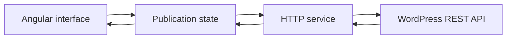

<div align="center">
  

# Sanaka

**Entre devagar. Aqui, código também é linguagem.**<br>
**Enter slowly. Here, code is also a language.**

Um santuário digital onde textos, personagens e experimentos de programação compartilham o mesmo espaço.<br>
A digital sanctuary where writings, characters, and programming experiments share the same space.


[Português](#português) · [English](#english)
</div>

---

<a id="português"></a>

## Português

### O que é este lugar?

O que acontece quando um arquivo deixa de ser apenas uma coleção de páginas e começa a responder a quem o atravessa?

Sanaka é a reconstrução técnica e editorial de um acervo mantido no WordPress. O conteúdo preserva sua história; o Angular lhe oferece uma nova forma, novas rotas e novas maneiras de ser explorado.

Por trás do santuário existe um experimento concreto: reunir identidade visual, conteúdo autoral e engenharia front-end em uma aplicação que também funciona como espaço de estudo.

Essa separação permite evoluir a interface sem perder o histórico já publicado e cria uma base para diferentes núcleos editoriais:

- **Sanaka:** pensamentos, estudos e conteúdos ligados ao santuário;
- **acervo de ficção:** contos, romances e personagens preservados da publicação anterior;
- **conteúdo compartilhado:** publicações que podem atravessar mais de um núcleo sem serem duplicadas no WordPress.

### O que já ganhou forma

- página inicial responsiva com identidade visual própria;
- interface disponível em português e inglês;
- arquivo de publicações consumido pela WordPress REST API;
- busca com espera de 300 ms entre a digitação e a requisição;
- leitura contínua com carregamento incremental;
- leitura paginada com URLs navegáveis;
- capas, categorias, títulos, resumos e datas vindos do WordPress;
- estados visuais de carregamento, erro, nova tentativa e ausência de resultados;
- carregamento tardio das rotas de publicações e de Māyā;
- renderização híbrida, combinando prerenderização e execução no navegador;
- testes unitários com Vitest.

### Como uma publicação atravessa o sistema

```mermaid
flowchart LR
    UI[Interface Angular] --> Store[Estado das publicações]
    Store --> Service[Serviço HTTP]
    Service --> API[WordPress REST API]
    API --> Service --> Store --> UI
```



Quando uma publicação aparece na tela, ela já atravessou algumas camadas. Cada uma guarda uma responsabilidade:

- o **componente** recebe interações e apresenta o estado;
- a **store** concentra paginação, busca, carregamento, erro e transições de estado;
- o **service** monta as requisições HTTP e converte a resposta do WordPress para o modelo usado pela aplicação;
- a **WordPress REST API** fornece o conteúdo editorial.

### O que existe por trás do véu

#### Portas abertas somente quando visitadas — Angular standalone e lazy loading

Os componentes são standalone e as áreas de publicações e de Māyā usam imports dinâmicos. Com isso, o código dessas rotas fica em chunks separados e só é baixado quando a pessoa navega até elas, reduzindo o trabalho necessário no carregamento inicial.

#### Pulso e corrente — Signals e RxJS

Os **Signals** expõem o estado atual de forma síncrona e reativa para a interface: lista de posts, página atual, modo de leitura e indicadores de carregamento ou erro.

O **RxJS** organiza operações assíncronas, como requisições HTTP, busca com debounce e cancelamento de uma consulta anterior quando uma nova pesquisa começa. Signals e RxJS cumprem papéis complementares: um apresenta o estado atual; o outro coordena o fluxo de eventos no tempo.

#### Um arquivo sem a antiga moldura — WordPress como CMS headless

O WordPress administra posts, categorias e mídias, mas não controla a interface do projeto. O Angular consulta a API pública, normaliza os dados e decide como apresentá-los. Essa abordagem preserva o acervo e desacopla o conteúdo do antigo tema WordPress.

#### Entre servidor e navegador — renderização híbrida

As páginas estáveis podem ser prerenderizadas durante o build. O arquivo de publicações, que depende de dados externos e interações como busca e paginação, é renderizado no navegador. A estratégia pode ser revista quando uma camada de backend própria for introduzida.

#### A mesma casa, duas línguas — internacionalização

Os textos da interface usam Transloco e podem ser alternados entre português e inglês. O idioma da interface não modifica automaticamente o idioma do conteúdo editorial vindo do WordPress.

### Caminhos disponíveis

| Rota                 | Finalidade                                  |
| -------------------- | ------------------------------------------- |
| `/`                  | Entrada do santuário                       |
| `/posts`             | Arquivo em leitura contínua                |
| `/posts/paged`       | Primeira página do modo paginado           |
| `/posts/paged/:page` | Página específica do arquivo              |
| `/maya`              | Espaço reservado para a evolução de Māyā |

### Ferramentas do santuário

| Tecnologia         | Uso no projeto                                                           |
| ------------------ | ------------------------------------------------------------------------ |
| Angular 22         | Componentes, rotas, injeção de dependências, Signals e renderização |
| TypeScript 6       | Tipagem e implementação da aplicação                                 |
| RxJS 7             | Fluxos assíncronos e requisições reativas                             |
| Transloco          | Internacionalização da interface                                       |
| WordPress REST API | Fonte do conteúdo editorial                                             |
| Angular SSR        | Renderização no servidor e prerenderização                           |
| Vitest             | Testes unitários                                                        |
| SCSS               | Estilos, responsividade e identidade visual                              |

### Abrindo o santuário localmente

#### Pré-requisitos

- Node.js compatível com Angular 22;
- npm 11 ou versão compatível.

#### Instalação e desenvolvimento

```bash
git clone https://github.com/brublurryface/sanaka.git
cd sanaka
npm install
npm start
```

A aplicação ficará disponível em `http://localhost:4200/`.

#### Testes e build

```bash
npx ng test --watch=false
npm run build
```

Os artefatos de produção são gerados em `dist/sanaka/`.

### Mapa do acervo

O repositório inclui uma auditoria reproduzível do conteúdo público do WordPress. Ela documenta categorias, destinos editoriais e uso de imagens destacadas sem modificar o CMS.

- [Conclusões da auditoria](./docs/wordpress-content-audit.md)
- [Script de auditoria](./scripts/audit-wordpress-content.ps1)
- [Dados gerados](./docs/data)

### O que ainda está germinando

- definir a taxonomia que distribuirá conteúdos entre diferentes experiências editoriais;
- criar a experiência editorial de leitura de cada publicação;
- avaliar uma camada de backend entre o Angular e o WordPress;
- desenvolver Māyā como companheira com estado, memória e permissões controladas;
- criar a **Matrix Online**, um portfólio técnico interativo com experimentos executáveis e demonstrações visuais de conceitos de programação;
- investigar separadamente personagens, sliders e mídias legadas do antigo site.

---

<a id="english"></a>

## English

### What is this place?

What happens when an archive stops being just a collection of pages and begins to respond to those who cross it?

Sanaka is the technical and editorial reconstruction of an archive maintained in WordPress. Its content preserves its history; Angular gives it a new form, new routes, and new ways to be explored.

Behind the sanctuary is a concrete experiment: bringing visual identity, original content, and front-end engineering into an application that also works as a place of study.

This separation makes it possible to evolve the interface without losing the published history and provides a foundation for different editorial collections:

- **Sanaka:** reflections, studies, and content connected to the sanctuary;
- **fiction archive:** short stories, novels, and characters preserved from the previous publication;
- **shared content:** publications that can cross more than one collection without being duplicated in WordPress.

### What has taken shape

- responsive home page with its own visual identity;
- user interface available in Portuguese and English;
- publication archive powered by the WordPress REST API;
- search with a 300 ms debounce between typing and requesting data;
- continuous reading with incremental loading;
- paginated reading with navigable URLs;
- covers, categories, titles, excerpts, and dates supplied by WordPress;
- loading, error, retry, and empty states;
- lazy-loaded publication and Māyā routes;
- hybrid rendering combining prerendering and client-side execution;
- unit tests with Vitest.

### How a publication crosses the system



By the time a publication reaches the screen, it has already crossed several layers. Each one guards a distinct responsibility:

- the **component** receives interactions and presents state;
- the **store** centralizes pagination, search, loading, errors, and state transitions;
- the **service** builds HTTP requests and maps WordPress responses to the application's model;
- the **WordPress REST API** provides the editorial content.

### Behind the veil

#### Doors opened only when visited — standalone Angular and lazy loading

The project uses standalone components, while the publication and Māyā areas use dynamic imports. Their code is emitted into separate chunks and downloaded only when someone navigates to the corresponding route, reducing the work required during the initial load.

#### Pulse and current — Signals and RxJS

**Signals** expose the current state synchronously and reactively to the interface, including the post list, current page, reading mode, and loading or error indicators.

**RxJS** coordinates asynchronous operations such as HTTP requests, debounced search, and cancellation of a previous query when a new search begins. Signals and RxJS have complementary roles: one exposes current state, while the other coordinates events over time.

#### An archive without its former frame — WordPress as a headless CMS

WordPress manages posts, categories, and media without controlling the project's interface. Angular queries the public API, normalizes the data, and decides how to present it. This approach preserves the archive while decoupling its content from the former WordPress theme.

#### Between server and browser — hybrid rendering

Stable pages can be prerendered during the build. The publication archive, which depends on external data and interactions such as search and pagination, currently runs in the browser. This strategy may be revisited when a dedicated backend layer is introduced.

#### One home, two interface languages — internationalization

Interface text is managed with Transloco and can be switched between Portuguese and English. Changing the interface language does not automatically translate editorial content received from WordPress.

### Available paths

| Route                | Purpose                             |
| -------------------- | ----------------------------------- |
| `/`                  | Sanctuary entrance                  |
| `/posts`             | Archive in continuous reading mode  |
| `/posts/paged`       | First page in paginated mode        |
| `/posts/paged/:page` | Specific archive page               |
| `/maya`              | Space reserved for Māyā's evolution |

### Tools behind the sanctuary

| Technology         | Role in the project                                               |
| ------------------ | ----------------------------------------------------------------- |
| Angular 22         | Components, routing, dependency injection, Signals, and rendering |
| TypeScript 6       | Application implementation and type safety                        |
| RxJS 7             | Asynchronous flows and reactive requests                          |
| Transloco          | Interface internationalization                                    |
| WordPress REST API | Editorial content source                                          |
| Angular SSR        | Server-side rendering and prerendering                            |
| Vitest             | Unit testing                                                      |
| SCSS               | Styling, responsiveness, and visual identity                      |

### Opening the sanctuary locally

#### Requirements

- a Node.js version compatible with Angular 22;
- npm 11 or a compatible version.

#### Installation and development

```bash
git clone https://github.com/brublurryface/sanaka.git
cd sanaka
npm install
npm start
```

The application will be available at `http://localhost:4200/`.

#### Tests and production build

```bash
npx ng test --watch=false
npm run build
```

Production artifacts are generated in `dist/sanaka/`.

### Archive map

The repository includes a reproducible audit of the public WordPress content. It documents categories, editorial destinations, and featured-media usage without modifying the CMS.

- [Audit findings](./docs/wordpress-content-audit.md)
- [Audit script](./scripts/audit-wordpress-content.ps1)
- [Generated data](./docs/data)

### What is still taking shape

- define the taxonomy used to distribute content across different editorial experiences;
- build the editorial reading experience for individual publications;
- evaluate a backend layer between Angular and WordPress;
- develop Māyā as a companion with state, memory, and controlled permissions;
- create **Matrix Online**, an interactive technical portfolio with executable experiments and visual programming demonstrations;
- investigate legacy characters, sliders, and media separately.

---

## Autoria · Author

Concebido e desenvolvido por / Conceived and developed by [Bruna Lourenço](https://github.com/brublurryface).
